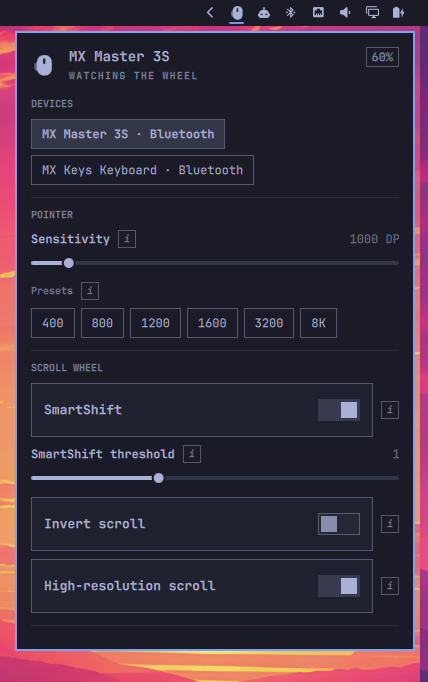

# MX Control

**Logi Options+ for the [Omarchy](https://omarchy.org/) bar.**

A first-class Quattro plugin for Logitech MX mice and keyboards — MX Master, Anywhere, Vertical, Ergo, Lift, MX Keys, and the rest of the family — over Bluetooth, USB-C, Bolt, Unifying, Nano, and Lightspeed.

It lives inside the long-running `omarchy-shell` process. It never starts a second Quickshell instance.

<p align="center">
  
</p>

## Install

Review the code first. Plugins run unsandboxed as your user.

```sh
omarchy plugin add https://github.com/zachwilke/omarchy-mxcontrol.git
```

That clones the repo into `~/.config/omarchy/plugins/io.github.zachwilke.mx/` and leaves it **disabled**. Read the files, then:

```sh
omarchy plugin enable io.github.zachwilke.mx
omarchy pkg add solaar
```

Or do both in one step after you have reviewed the source:

```sh
omarchy plugin add https://github.com/zachwilke/omarchy-mxcontrol.git --enable
omarchy pkg add solaar
```

Solaar is optional until you want to change settings. Without it the bar still lists connected MX devices. After installing Solaar, reconnect the device (or toggle its Bluetooth channel / unplug and replug the receiver) so the hidraw udev rules apply.

Move the widget if you want it somewhere else:

```sh
omarchy bar move io.github.zachwilke.mx --section right
```

`omarchy plugin add` only clones files and toggles enabled state. It does not run install hooks, does not use sudo, and does not overwrite your Hyprland or Solaar config.

## Remove

```sh
omarchy plugin disable io.github.zachwilke.mx
omarchy plugin remove io.github.zachwilke.mx
```

Removal deletes the plugin checkout and takes the widget out of the bar. On unload the helper stops and clears the private runtime directory (`$XDG_RUNTIME_DIR/omarchy-mx/` or `/run/user/$UID/omarchy-mx/`).

Left in place on purpose:

| Path | Why it stays |
| --- | --- |
| `solaar` package | Shared system package; other tools may use it |
| `~/.config/solaar/` | Your saved device profiles |
| Device onboard settings | DPI, SmartShift, remaps live on the hardware |

Nothing in `~/.config/hypr/` or the rest of `~/.config/omarchy/` is rewritten except the bar layout entry that `omarchy plugin remove` already owns.

## Usage

| Input | Action |
| --- | --- |
| Left click | Open or close the panel |
| Right click | Refresh discovery |
| Hover **i** | Explain that setting |
| Escape | Close the panel |
| `j` / `k` | Move the panel cursor |
| Enter | Activate the focused control |
| `r` | Refresh |

```sh
omarchy-shell shell summon io.github.zachwilke.mx '{}'
omarchy-shell shell hide io.github.zachwilke.mx
```

### What you can change

- Battery and connection (Bluetooth, USB, Bolt, Unifying, Lightspeed)
- Sensitivity in 50 DPI steps, including **8K** (8000 DPI)
- SmartShift (ratchet vs free-spin) and its threshold
- Scroll invert and high-resolution scroll
- Thumb-wheel invert
- Easy Switch hosts
- Button remaps the device exposes
- Keyboard extras such as Fn swap and backlight

## Configure

Settings live on the bar layout entry in `~/.config/omarchy/shell.json`. The plugin does not keep a separate config file.

| Key | Default | Meaning |
| --- | --- | --- |
| `refreshIntervalSec` | `15` | How often to rescan hidraw when the helper is idle. Cheap sysfs only — it does not open HID++. |
| `selectedDevice` | `""` | Preferred device id; empty prefers the mouse |

## External dependencies

Nothing is installed automatically. `omarchy plugin add` only clones this repo.

### Required (already on Omarchy)

| Dependency | Package | Used for |
| --- | --- | --- |
| Omarchy 4 / Quattro | `omarchy` | Hosts the plugin inside `omarchy-shell` (Quickshell). No second Quickshell process. |
| Python 3 | `python` | Runs `mxctl.py`. Only the stdlib is imported unless Solaar is present. |
| bash | `bash` | Optional **Reload udev** command line only. |

### Optional

| Dependency | Package | License | Used for |
| --- | --- | --- | --- |
| [Solaar](https://github.com/pwr-Solaar/Solaar) | `solaar` (Arch extra) | GPL-2.0-or-later | HID++ read/write through `logitech_receiver` and `solaar.configuration`. Also ships the udev rules that make `/dev/hidraw*` user-accessible. |
| BlueZ | `bluez` | GPL-2.0-or-later | Battery overlay via `Quickshell.Bluetooth` when the HID++ helper is not open. |
| udev | `systemd` | LGPL-2.1-or-later | Only if you click **Reload udev**. |

Install Solaar yourself:

```sh
omarchy pkg add solaar
```

The panel’s **Install Solaar** button runs that same command in a terminal (`omarchy-launch-tui`). It does not install packages silently.

### Commands this plugin may start

| Command | When | Privilege |
| --- | --- | --- |
| `python3 mxctl.py discover` | Periodic hidraw scan | User |
| `python3 mxctl.py serve` | After you open the panel (keeps hidraw open) | User |
| `python3 mxctl.py write-cmd` | Panel setting changes (writes `cmd.json`) | User |
| `python3 mxctl.py runtime-dir` | Creates the private runtime directory | User |
| `python3 mxctl.py cleanup` | Plugin unload / remove | User |
| `omarchy-launch-tui omarchy pkg add solaar` | **Install Solaar** button | User; you confirm the package install |
| `omarchy-launch-tui sudo bash -lc 'udevadm control --reload-rules && udevadm trigger'` | **Reload udev** button | You type your password in a terminal. Never run automatically. |

No pip packages, no AUR-only packages, no remote downloads, no install hooks.

### Runtime files

`$XDG_RUNTIME_DIR/omarchy-mx/` when that variable is set, otherwise `/run/user/$UID/omarchy-mx/` (`status.json`, `cmd.json`, `mxctl.lock`). Created mode `0700` as your user. Never `/tmp`. Deleted by `mxctl.py cleanup` when the plugin unloads.

### Privileges

The helper talks to `/dev/hidraw*` as your user. Solaar’s udev rules grant that access after you install Solaar and reconnect the device. The plugin never writes `/etc`, never edits `~/.config/hypr/`, and never starts a second Quickshell process.

`~/.config/solaar/` is Solaar’s own store. This plugin may update it when you change a setting (through Solaar’s library). Removal does not delete that directory.

## Develop

```sh
omarchy plugin validate .
python3 mxctl.py discover
python3 mxctl.py cleanup
python3 -m unittest discover -s test -v
```

Idle cost: the bar path only scans sysfs (no Solaar import, no hidraw open). After you open the panel the helper blocks on inotify for `cmd.json` and hidraw plug events instead of waking on a timer.

Saved files under `~/.config/omarchy/plugins/io.github.zachwilke.mx/` reload automatically. If a change looks stale:

```sh
omarchy-shell shell rescanPlugins
omarchy restart shell
```

## License

[GPL-2.0-or-later](LICENSE). Copyright © 2026 Zach Wilke.

The Python helper imports Solaar’s `logitech_receiver` library, which is also GPL. See [Solaar](https://github.com/pwr-Solaar/Solaar).
